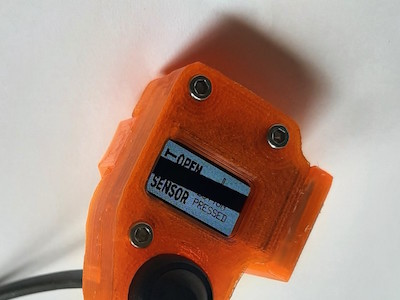
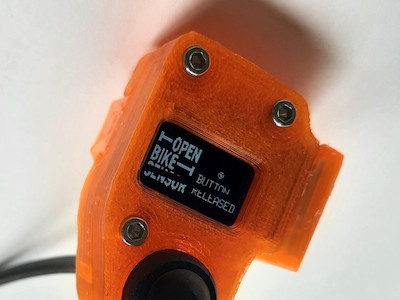

# OBS display module test

This folder contains an Arduino project to test an OpenBikeSensor display module. The module has an SSD1306 128x64 pixels I2C OLED display and a push button.

Just look into the source code: [`ObsDisplayButtonTest.ino`](ObsDisplayButtonTest.ino)

The OBS logo is shown on the display

- in white on black when the button is not pressed (i.e. released)
- in black on white when the button is pressed 

along with some unicode symbols.

Make sure your hardware and the display operate on compatible voltage levels!

## Compatible hardware

Many Arduino-compatible boards should work.

The sketch has been used and tested with ...

* the original OBS hardware (ESP32-based),
* Arduino Micro and
* Arduino UNO1.

1 *The SSD1306 is not meant to be operated with 5V logic level. Use at your own risk and make sure that 3V3 is used for the display's VCC.*

## Arduino library dependencies

* U8g2: Library for monochrome displays, version 2

## Photos

*(Black line only visible in photo. Finger not visible due to demo mode.)*

## Credits

The following fonts have been used with U8G2:

* `u8g2_font_7x13_t_symbols`
* `u8g2_font_unifont_t_symbols`

## References

The OBS logo bitmap has been taken from https://github.com/openbikesensor/OpenBikeSensorFirmware/blob/b4db7c662f48321e686d175fd6e9fc4e9c56afd5/src/logo.h#L31.
