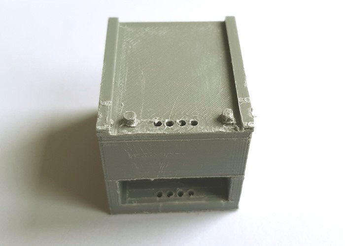
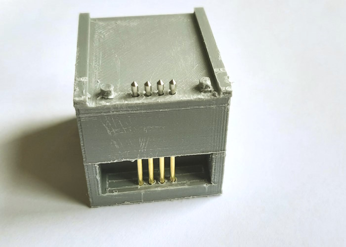
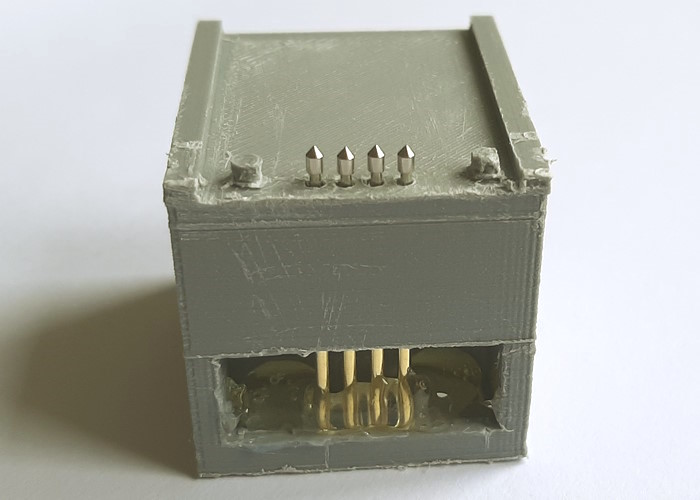
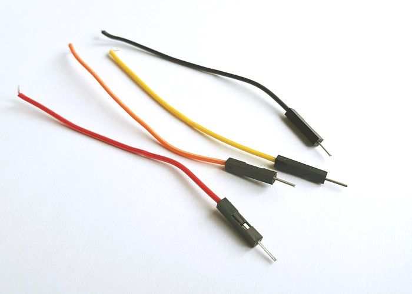
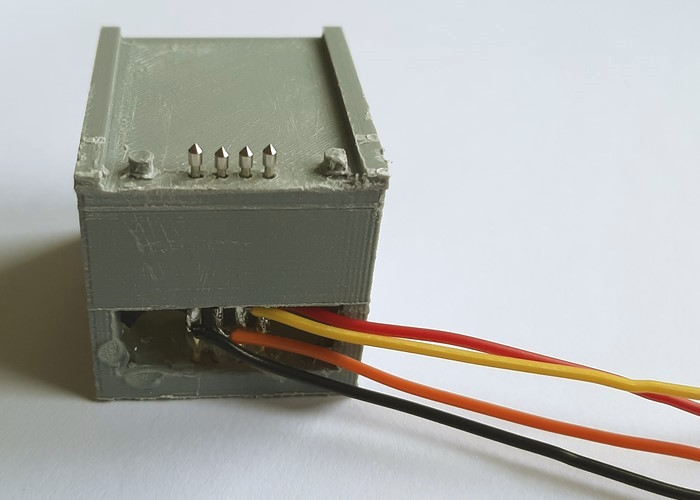
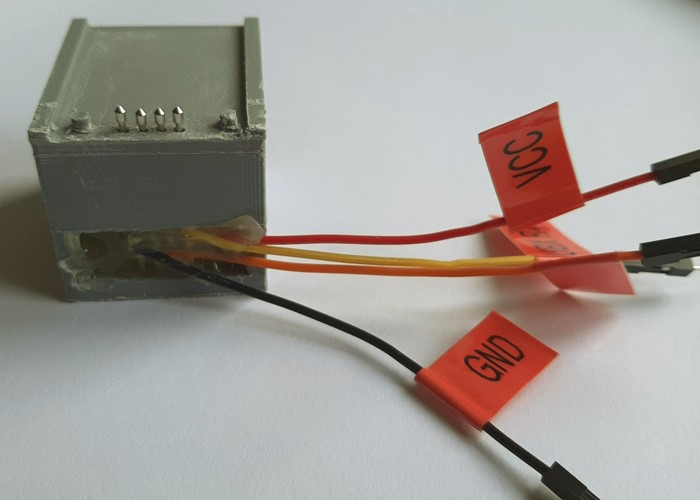
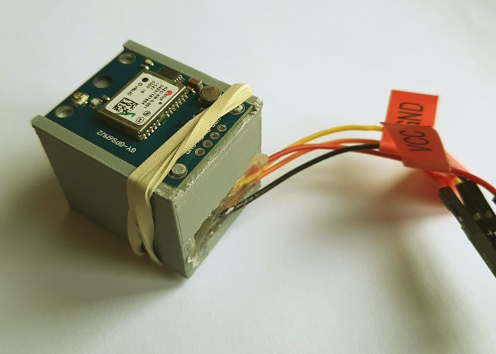
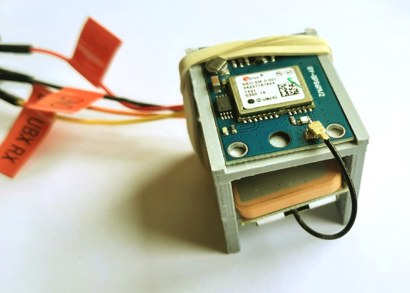

# OBS GPS module test jig

I've made a tiny test jig with pogo pins for u-blox NEO-6M modules in TinkerCad that can be 3D-printed. This allows to test the GPS modules without soldering.

This is what the 3D model looks like:

You slide the GPS module in on top and connect it via with a USB/serial converter cable to a Windows PC. You can then use the [u-blox u-center](https://www.u-blox.com/en/product/u-center?lang=de) GNSS evaluation software for Windows to test the module.

Please note that the current version (Rev2) will need "support" when being printed with a regular 3D printer.

You can view the model in GitHub's online viewer and download it here: 
[Test jig Rev2 `.stl` file](./NEO-6M-Testjig%20Rev2.stl) 

You can also access the model here:
https://www.tinkercad.com/things/4J0NRdtHvyN

Please note that the model is licensed [CC BY-SA 3.0](https://creativecommons.org/licenses/by-sa/3.0/).

## Build instructions

* Download `.stl` file
* Slice it (with "support")
* 3D-print it
* Remove "support" from 3D print and clean it
* Re-drill holes when necessary, clean the print again

* Insert pogo pins

* Fix pogo pins using some hotglue (not as much as shown in the image)

* Prepare some breadboard wire halves

* Solder breadboard wires

* Add more hotglue to fix the wires, add labels

## Usage instructions

* Place GPS module on top of the jig, fix with a rubber band (at least in Rev2, as the fixation breaks away)

* Attach GPS antenna and stow on back

* Attach breadboard wire ends to USB/serial converter
* Ready to use u-blox u-center!

## Contributing

Improvements more than welcome!

## References

- https://forum.openbikesensor.org/t/wiki-gps-module-mittels-eines-uart-testen/327
- https://forum.openbikesensor.org/t/wiki-gps-troubleshooting-fehlersuche/170