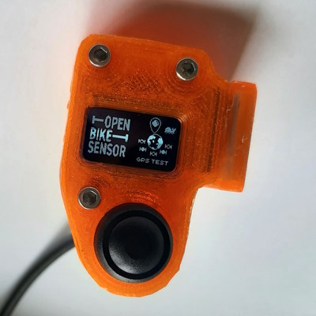
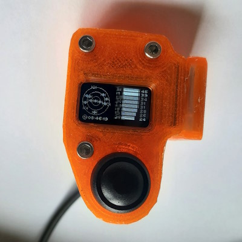

 

# OBS GPS test

This folder contains an Arduino project to test an OpenBikeSensor GPS module. It also requires an OBS display module (or at least its SSD1306 128x64 pixels I2C OLED display and optionally a push button).

Just look into the source code: [`ObsGpsTest.ino`](ObsGpsTest.ino)

> **Warning**  
> This test code has only been tested successfully with GPS modules that automatically start transmitting NMEA messages. Please also note that the ESP itself requires some time to boot until it can receive data from the GPS module. So far no success with UBX messages - so please no wrong exceptions. There's no activation of cyclic messages nor any polling mechanism. Just a tiny attempt to get any UBX message by sending one UBX message to the module and expecting an ACK-NAK response (not seen so far on my modules). You can help testing and improving this test code on your modules! :)

## Usage

The firmware has three views:

1. An animated splash screen view
2. Satellite constellation, UTC time and signal strength view
3. Error view

### Splash screen

Dependent on the button status at startup, the sketch tries to connect to the u-blox NEO-6M module via serial at either 9600 or 115'200 baud. When the button is not pressed, the slow baudrate (9600) will be used and a snail icon is shown. When the button is pressed, the fast baudrate (115'200) will be used and a rabbit icon is shown.

### Error view

Something must have gone wrong when this view appears - there's no valid communication with the GPS module. This is also indicated with a "broken link" symbol. In addition, the baudrate is printed as number and a "speed indicator" is shown (rabbit or snail icon). Check your wiring - maybe the power supply connection is broken or UBX TX/ uC RX not connected properly.

The display will give additional info if data has been received that could be UBX binary data or NMEA data ("NO RX DATA": neither UBX nor NMEA seen, "UBX RX ONLY": only UBX binary data seen but requiring NMEA, "NMEA BROKEN": seen data that could be NMEA but it seems invalid or incomplete).

Please note that the UBX RX/ uC TX line is not relevant for the current type of communication and therefore not tested so far.

Reset the target hardware to try again.

You can also press the button to switch to the higher baudrate and retry again after reset (hold the button pressed until the splash screen appears!).

### Satellite constellation, UTC time and signal strength

When the sketch on the hardware is able to communicate with the GPS module via serial and receives NMEA messages, it will show the satellite constellation, UTC time and signal strengths:

Actually not signal strength, but signal-to-noise ratio (SNR) or [carrier-to-noise ratio](https://en.wikipedia.org/wiki/Carrier-to-noise_ratio) (C/N0).

The constellation view on the left side shows all satellites with their azimuth and elevation from the receiver's perspective. Satellites are drawn with a filled out body when their C/N0 is >= 15.

Below the constellation, the current UTC time is displayed.

On the right side there's a list of satellites with their name (left column) sorted descended by their "signal strength", i.e. the satellite with the strongest signal comes first. The numbers in the right column are the C/N0 values. As there's only limited display space, only up to 8 satellites are listed!

***Note**: The current version does not match the image from above. It should show 7 signal strength bars instead of 8. It also has two indicators that show if any UBX or NMEA messages have been received. (Only tested for NMEA so far.)*

## Compatible hardware

Different Arduino-compatible boards1 should work.

The sketch has been used and tested with ...

* the original OBS hardware (ESP32-based),
* an ESP32-based together with an OBS display module and a u-blox NEO-6M module in the [GPS module test jig](../ObsGpsModuleTestJig/README.md) of this repository.

1 *This project uses a lot of code and data memory as it makes use of big libraries. It does not fit into an Arduino UNO or Arduino Leonardo. Don't try... using almost all RAM will make the sketch work very unreliably, e.g. copying memory or sorting will fail, the execution may randomly halt. You could free up space by using different libraries though.*

## Arduino library dependencies

* **TinyGPSPlus**: customizable Arduino NMEA parsing library
* **U8g2**: Library for monochrome displays, version 2
* **SoftwareSerial implementation**: ESP32 is not supported by default; **EspSoftwareSerial** works

## Credits

The following fonts have been used with **[U8G2](https://github.com/olikraus/u8g2)**:

* `u8g2_font_chikita_tn`
* `u8g2_font_siji_t_6x10`
* `u8g2_font_streamline_*_t`
* `u8g2_font_unifont_t_animals`

**[TinyGPSPlus](https://github.com/mikalhart/TinyGPSPlus)** made it very easy to get satellite elevation, azimuth and "signal strength" from the NMEA messages. The [`SatElevTracker.ino` example](https://github.com/mikalhart/TinyGPSPlus/blob/master/examples/SatElevTracker/SatElevTracker.ino) was a very good starting point.

## References

The OBS logo bitmap has been taken from https://github.com/openbikesensor/OpenBikeSensorFirmware/blob/b4db7c662f48321e686d175fd6e9fc4e9c56afd5/src/logo.h#L31.
