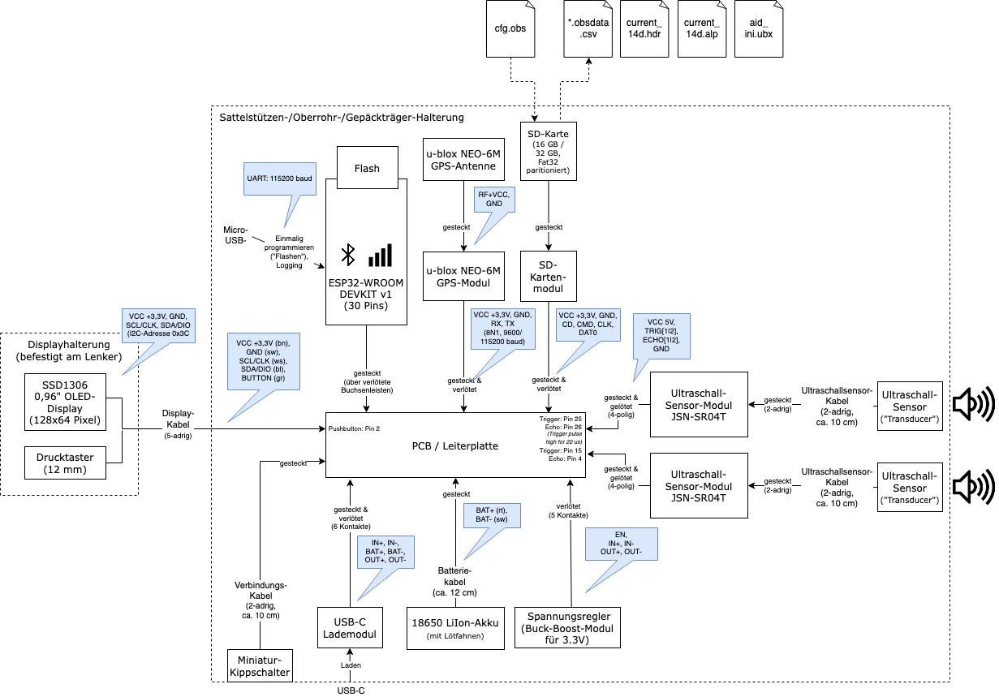

# OpenBikeSensor hardware module tests

This git repository contains some experimental parts that may help to test hardware modules of the OpenBikeSensor (OBS).

So far, there's ...

* the [OBS display module test](./ObsDisplayButtonTest/README.md) and
* the [OBS GPS module test jig](./ObsGpsModuleTestJig/README.md).
* the [OBS GPS test](./ObsGpsTest/README.md).

Also related, but not yet used to test OBS:

* [Simulator of u-blox 6 serial communication protocol (UBX) ](https://github.com/maehw/ubx-gps-simulator), so no real GPS module hardware required

I also made the following block diagram of the OpenBikeSensor as an overview:

You can use the [source .drawio](./System/OBS_System_Diagram.drawio) file (XML) to modify and tweak it on [diagrams.net](https://app.diagrams.net/) (or compatible tools).

## Contributing

Improvements and additions more than welcome!

## References

- https://www.openbikesensor.org/
- https://www.openbikesensor.org/docs/
- https://forum.openbikesensor.org/